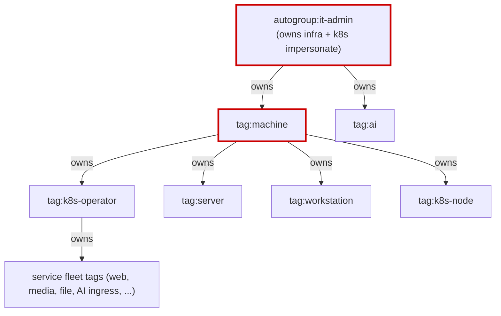
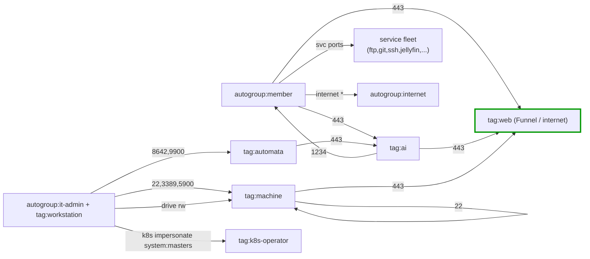

<!-- owner: shikanime (it-admin) | zone: internal | purpose: single reference for every tailnet network boundary and its security blast radius -->

# Tailnet Network Boundaries

Source of truth: [`policy.hujson`](../policy.hujson). Applied to control by CI
(`gitops-acl-action`) on push to `main` and on `workflow_dispatch`; a pull
request runs the `test` job only, never `apply`. Editing the admin console
directly makes the next run warn — always re-export before touching the file.

This page is the human-readable map of the trust model. It is generated by
reading the policy; it does not change enforcement. Last audited against the
committed file at the commit that introduced this document.

## Schema

Every boundary in this document follows one of two shapes.

### Boundary (a grant)

```yaml
id:        <stable-slug>        # unique, kebab-case
src:       [<identity>...]      # who initiates; user, tag, autogroup, CIDR
dst:       [<identity>...]      # who is reached
ports:     [<port|range>...]    # "*" = all TCP/UDP; absent = app-cap grant
cap:       <name>               # tailscale.com/cap/* app capability grant
rationale: <one line>           # why this access exists
line:      <policy.hujson line> # citation into the source of truth
```

### Invariant (a deny test)

```yaml
id:        <stable-slug>
src:       <identity|tag>
deny:      [<dst:port>...]      # asserted never reachable
line:      <policy.hujson line>
```

`src`/`dst` vocabulary:

| Prefix | Meaning |
|--------|---------|
| `autogroup:member` | every user in the tailnet |
| `autogroup:it-admin` | users with tailnet admin role |
| `autogroup:self` | a node's own owner |
| `autogroup:nonroot` / `autogroup:internet` | built-in groups |
| `tag:<x>` | a node carrying tag `x` |
| `10.244.0.0/16`, `fd00::/108` | pod/cluster CIDR |

Note: each `src`/`dst` array is an OR (union) — `[a, b]` matches a *or* b,
not both. A grant with `src: ["autogroup:it-admin", "tag:workstation"]`
therefore applies to it-admin **or** any workstation node.

## Boundaries

### Kubernetes operator plane (it-admin only)

- `k8s-impersonate` — it-admin + workstation → `tag:k8s-operator`.
  cap `tailscale.com/cap/kubernetes` impersonate `system:masters`.
  line 17. Rationale: admin cluster control.
- `k8s-api` — it-admin + workstation → `tag:k8s-operator:443`.
  line 95. Rationale: operator API reach.

### Drive shares

- `member-drive-rw-self` — member → `autogroup:self`, cap `drive` rw. line 26.
- `machine-drive-ro` — member + machine → member + machine, cap `drive` ro.
  line 39.
- `admin-drive-rw` — it-admin + workstation → member + machine, cap `drive` rw.
  line 52.

### Infrastructure access (it-admin + workstation)

- `ssh-infra` — it-admin + workstation -> member, machine, or catbox `:22`.
  line 70.
- `rdp-infra` — it-admin + workstation -> member, machine, or catbox `:3389`.
  line 75.
- `vnc-infra` — it-admin + workstation -> member, machine, or catbox `:5900`.
  line 80.
- `automata-ctl-8642` — it-admin + workstation → `tag:automata:8642`. line 85.
- `automata-ctl-9900` — it-admin + workstation → `tag:automata:9900`. line 90.

### Member service allow-list

All src `autogroup:member`:

| id | dst | ports | line |
|----|-----|-------|------|
| `m-web` | `tag:ai`, `tag:web` | 443 | 100 |
| `m-bittorrent` | `tag:bittorrent` | 6881 | 105 |
| `m-ftp-21` | `tag:ftp` | 21 | 110 |
| `m-ftp-22` | `tag:ftp`,`tag:git`,`tag:ssh` | 22 | 115 |
| `m-ftp-990` | `tag:ftp` | 990 | 120 |
| `m-ftp-passive` | `tag:ftp` | 12000-12099 | 125 |
| `m-jellyfin-disc` | `tag:jellyfin` | 1900 | 130 |
| `m-jellyfin-client` | `tag:jellyfin` | 7359 | 135 |
| `m-matrix` | `tag:matrix` | 8448 | 140 |
| `m-syncthing-disc` | `tag:syncthing` | 21027 | 145 |
| `m-syncthing-peer` | `tag:syncthing` | 22000 | 150 |
| `m-syncthing-tls` | `tag:syncthing` | 443 | 155 |
| `m-workstation-game` | `tag:workstation` | 25565 | 160 |
| `m-internet` | `autogroup:internet` | * | 65 |

### Service-to-service (tag-based)

- `ai-egress-member` — `tag:ai` → `[autogroup:member, tag:workstation]:1234`.
  line 165.
- `ai-web` — `tag:ai` → `tag:web:443`. line 170.
- `automata-ai` — `tag:automata` → `tag:ai:443`. line 175.
- `automata-automata` — `tag:automata` → `tag:automata:8642` and `:9900`.
  lines 180, 185.
- `machine-machine-ssh` — `tag:machine` → `tag:machine:22`. line 190.
- `machine-web` — `tag:machine` → `tag:web:443`. line 195.
- `nishir-egress` — `tag:nishir-k8s-egress` → `tag:ai:*`. line 200.
- `pod-mesh` — `[tag:k8s-node, 10.244.0.0/16, fd00::/108]` → same, ports `*`.
  line 205.

### SSH

| id | src | dst | users | action | line |
|----|-----|-----|-------|--------|------|
| `ssh-admin` | `[autogroup:it-admin, tag:workstation]` | `tag:machine` | nonroot, root | accept | 236 |
| `ssh-builder` | `[autogroup:member, tag:machine]` | `tag:machine` | builder | accept | 243 |
| `ssh-self` | `autogroup:member` | `autogroup:self` | nonroot | check | 248 |

### autoApprovers

- Routes `10.244.0.0/16`, `fd00::/108` → `tag:k8s-node` (line 7).
- Exit node → `tag:server` (line 11).
- Service `svc:nishir` → `tag:k8s-node` (line 12).

### nodeAttrs

- `tag:web` → `funnel` (ingress from the public internet). line 213.
- `[autogroup:member, tag:machine]` → `drive:share`, `drive:access`. line 217.
- Three fixed IPs → `mullvad` (exit via Tailscale/Mullvad). lines 221-231.

## Tag-ownership DAG and blast radius

`tagOwners` decides who may apply a tag. Only `autogroup:it-admin` and
`tag:machine` (and its children) own tags; the cluster operators own the
service fleet. The DAG:



Blast-radius notes:

- **`autogroup:it-admin`** owns the entire machine fleet and can impersonate
  `system:masters` on the cluster (line 21). Compromise of an it-admin account
  is total infrastructure compromise.
- **`tag:machine`** owns the Kubernetes nodes and operators; it is the root of
  the service tree. A machine node can re-tag every service.
- **`tag:k8s-operator`** owns the entire application fleet (web, media, file
  transfer, AI ingress). It cannot tag `ai` or `machine` directly, bounding
  lateral escalation to infra.

## External attack surface

Reachable from outside the tailnet:

- **Funnel on `tag:web`** (line 213) — the only nodeAttrs ingress. Any web-tagged
  node is publicly reachable on its Funnel ports; `tag:web:443` is therefore
  internet-facing. Scope it to static content only.
- **Mullvad exit nodes** (lines 221-231) — named IPs route egress through
  Mullvad; not an inbound surface.
- **`autogroup:internet`** (line 65) — members may egress to the internet, not
  an inbound path.

Inbound-from-internet is limited to Funnel. Everything else is tailnet-only.

### Reachability at a glance



## Security-posture findings

Audited from the committed `policy.hujson` (no live diff performed here).

### Passed invariants

The non-user deny tests encode correct zero-trust backstops:
`tag:machine`→`tag:ai:443` drop (333), `tag:web`→`tag:ai:443` drop (338),
`tag:k8s-node`→`tag:machine:22` drop (343), `tag:machine`→`tag:workstation`
A2A drop (351). These hold against the committed grants.

### Gaps (open)

- **G3 — file has drifted from the admin console.** The CI `test` job still
  warns "policy file was modified externally in the admin console." The
  committed `policy.hujson` may not be the live source of truth. Per AGENTS.md
  this must be re-exported and reconciled before any `apply`; the drift may
  already widen or narrow the boundaries above. (G1, G2, G4 below are now
  closed by PR #12.)

### Closed (this audit)

- **G1 — admin `deny` assertions removed.** The prior `tests` asserted
  `shikanime.deva@gmail.com` (it-admin stand-in) was *dropped* from
  `tag:ai:443` and `tag:web:443`. The stand-in is also a member, and line 100
  grants `autogroup:member` those ports — so the deny could never hold. Those
  two tests were removed; the `test` job now passes.
- **G2 — member `accept` assertion removed.** The prior `tests` asserted
  `member.example@shikanime.studio` *accepts* `tag:web:443`. A non-existent
  stand-in email resolves to no grants (Drop), and `tag:web:443` is granted
  only to `tag:machine`/`tag:ai`. The assertion was invalid and was removed.
- **G4 — `tests` are now CI-enforced and green.** PR #12's corrected `tests`
  block passes the `test` job, so the remaining invariants are proven, not
  assumed.

### Recommended remediation

1. Re-export the live ACL from the admin console and diff against this file;
   reconcile before any policy change (closes G3).

## References

- [`policy.hujson`](../policy.hujson) — source of truth
- [Tailscale ACL docs](https://tailscale.com/kb/1018/acls)
- [Autogroup-in-tests limitation](https://github.com/tailscale/tailscale/issues/4416)
