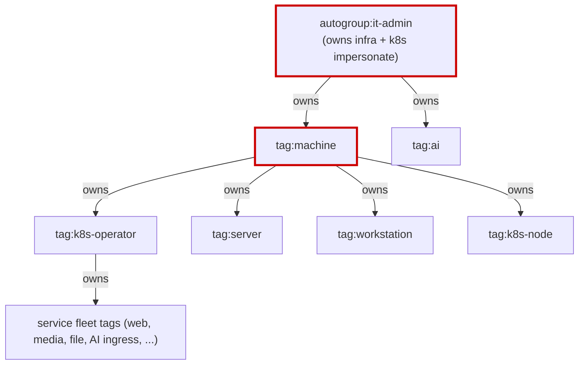
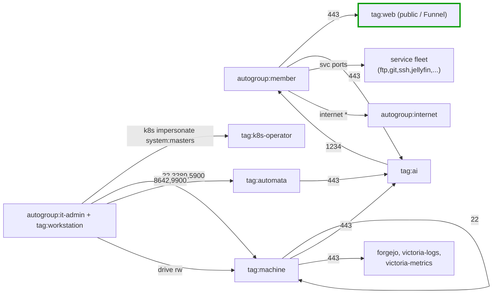

<!-- owner: shikanime (it-admin) | zone: internal | purpose: single reference for every tailnet network boundary and its security blast radius -->

# Tailnet Network Boundaries

Source of truth: [`policy.hujson`](../policy.hujson). Applied to control by CI
(`gitops-acl-action`) on push to `main` and on `workflow_dispatch`; a pull
request runs the `test` job only, never `apply`. Editing the admin console
directly makes the next run warn — always re-export before touching the file.

This page is the human-readable map of the trust model. It is generated by
reading the policy; it does not change enforcement. Last audited against the
committed file at the commit that introduced this document.

## Schema

Every boundary in this document follows one of two shapes.

### Boundary (a grant)

```yaml
id:        <stable-slug>        # unique, kebab-case
src:       [<identity>...]      # who initiates; user, tag, autogroup, CIDR
dst:       [<identity>...]      # who is reached
ports:     [<port|range>...]    # "*" = all TCP/UDP; absent = app-cap grant
cap:       <name>               # tailscale.com/cap/* app capability grant
rationale: <one line>           # why this access exists
line:      <policy.hujson line> # citation into the source of truth
```

### Invariant (a deny test)

```yaml
id:        <stable-slug>
src:       <identity|tag>
deny:      [<dst:port>...]      # asserted never reachable
line:      <policy.hujson line>
```

`src`/`dst` vocabulary:

| Prefix | Meaning |
|--------|---------|
| `autogroup:member` | every user in the tailnet |
| `autogroup:it-admin` | users with tailnet admin role |
| `autogroup:self` | a node's own owner |
| `autogroup:nonroot` / `autogroup:internet` | built-in groups |
| `tag:<x>` | a node carrying tag `x` |
| `10.244.0.0/16`, `fd00::/108` | pod/cluster CIDR |

Note: each `src`/`dst` array is an OR (union) — `[a, b]` matches a *or* b,
not both. A grant with `src: ["autogroup:it-admin", "tag:workstation"]`
therefore applies to it-admin **or** any workstation node.

## Boundaries

### Kubernetes operator plane (it-admin only)

- `k8s-impersonate` — it-admin + workstation → `tag:k8s-operator`.
  cap `tailscale.com/cap/kubernetes` impersonate `system:masters`.
  line 17. Rationale: admin cluster control.
- `k8s-api` — it-admin + workstation → `tag:k8s-operator:443`.
  line 95. Rationale: operator API reach.

### Drive shares

- `member-drive-rw-self` — member → `autogroup:self`, cap `drive` rw. line 26.
- `machine-drive-ro` — member + machine → member + machine, cap `drive` ro.
  line 39.
- `admin-drive-rw` — it-admin + workstation → member + machine, cap `drive` rw.
  line 52.

### Infrastructure access (it-admin + workstation)

- `ssh-infra` — it-admin + workstation -> member, machine, or catbox `:22`.
  line 70.
- `rdp-infra` — it-admin + workstation -> member, machine, or catbox `:3389`.
  line 75.
- `vnc-infra` — it-admin + workstation -> member, machine, or catbox `:5900`.
  line 80.
- `automata-ctl-8642` — it-admin + workstation → `tag:automata:8642`. line 85.
- `automata-ctl-9900` — it-admin + workstation → `tag:automata:9900`. line 90.

### Member service allow-list

All src `autogroup:member`:

Service tags sit on the proxies and Ingresses themselves (`tag:jellyfin`,
`tag:matrix`, `tag:copyparty`, …). `tag:web` is the one public marker: the
services the Funnel exposes to the internet carry it, and it is all the
`funnel` nodeAttr grants.

| id | dst | ports | line |
|----|-----|-------|------|
| `m-web` | `tag:ai` and every per-service web tag | 80, 443 | 100 |
| `m-bittorrent` | `tag:bittorrent` | 6881 | 137 |
| `m-ftp-21` | `tag:ftp` | 21 | 142 |
| `m-ftp-22` | `tag:ftp`,`tag:git`,`tag:ssh` | 22 | 147 |
| `m-ftp-990` | `tag:ftp` | 990 | 152 |
| `m-ftp-passive` | `tag:ftp` | 12000-12099 | 157 |
| `m-jellyfin-disc` | `tag:jellyfin` | 1900 | 162 |
| `m-jellyfin-client` | `tag:jellyfin` | 7359 | 167 |
| `m-matrix` | `tag:matrix` | 8448 | 172 |
| `m-syncthing-disc` | `tag:syncthing` | 21027 | 177 |
| `m-syncthing-peer` | `tag:syncthing` | 22000 | 182 |
| `m-syncthing-tls` | `tag:syncthing` | 443 | 187 |
| `m-workstation-game` | `tag:workstation` | 25565 | 192 |
| `m-internet` | `autogroup:internet` | * | 65 |

### Service-to-service (tag-based)

- `ai-egress-member` — `tag:ai` → `[autogroup:member, tag:workstation]:1234`.
  line 195. Rationale: the AI gateway fans out to the LM Studio instances on
  member computers. It reaches nothing else.
- `machine-ai` — `tag:machine` → `tag:ai:443`. line 220. Rationale: the hermes
  agent on every fleet host calls the model gateway (`profiles/ai.nix` builds
  its providers on `inference.i.shikanime.studio`). Confirmed live from ashira
  and kushira.
- `automata-services` — `tag:automata` → `tag:honcho`, `tag:matrix`, `tag:web`
  `:443`. line 235. Rationale: honcho is the Automata agents' memory store and
  the matrix homeserver is where they coordinate; `tag:web` covers the public
  Funnel nodes (`matrix`, `copyparty`), which are the hostnames those agents
  dial (`matrix.taila659a.ts.net`).
- `machine-web` — `tag:machine` → `tag:forgejo`, `tag:victoria-logs`,
  `tag:victoria-metrics` `:443`. line 225. Rationale: the fleet hosts' own
  config consumes exactly these (`profiles/base.nix` fetches the flake from
  forgejo and remote-writes to metrics and logs). They are not clients of the
  media, mirror, memory, or funnel services.
- `automata-ai` — `tag:automata` → `tag:ai:443`. line 200.
- `automata-automata` — `tag:automata` → `tag:automata:8642` and `:9900`.
  lines 205, 210.
- `machine-machine-ssh` — `tag:machine` → `tag:machine:22`. line 215.
- `nishir-egress` — `tag:nishir-k8s-egress` → `tag:ai:*`. line 239.
- `pod-mesh` — `[tag:k8s-node, 10.244.0.0/16, fd00::/108]` → same, ports `*`.
  line 244.

### SSH

| id | src | dst | users | action | line |
|----|-----|-----|-------|--------|------|
| `ssh-admin` | `[autogroup:it-admin, tag:workstation]` | `tag:machine` | nonroot, root | accept | 278 |
| `ssh-builder` | `[autogroup:member, tag:machine]` | `tag:machine` | builder | accept | 284 |
| `ssh-self` | `autogroup:member` | `autogroup:self` | nonroot | check | 290 |

### autoApprovers

- Routes `10.244.0.0/16`, `fd00::/108` → `tag:k8s-node` (line 7).
- Exit node → `tag:server` (line 11).
- Service `svc:nishir` → `tag:k8s-node` (line 12).

### nodeAttrs

- `tag:web` → `funnel` (ingress from the public internet). line 253.
- `[autogroup:member, tag:machine]` → `drive:share`, `drive:access`. line 257.
- Three fixed IPs → `mullvad` (exit via Tailscale/Mullvad). lines 261-270.

## Tag-ownership DAG and blast radius

`tagOwners` decides who may apply a tag. Only `autogroup:it-admin` and
`tag:machine` (and its children) own tags; the cluster operators own the
service fleet. The DAG:


```mermaid
graph TD
    ADMIN["autogroup:it-admin<br/>(owns infra + k8s impersonate)"]
    MACHINE["tag:machine"]
    KOP["tag:k8s-operator"]
    SERVER["tag:server"]
    WS["tag:workstation"]
    KNODE["tag:k8s-node"]
    SUB["service fleet tags (web, media, file, AI ingress, ...)"]

    ADMIN -->|owns| MACHINE
    ADMIN -->|owns| AI["tag:ai"]
    MACHINE -->|owns| SERVER
    MACHINE -->|owns| WS
    MACHINE -->|owns| KNODE
    MACHINE -->|owns| KOP
    KOP -->|owns| SUB

    classDef root stroke:#c00,stroke-width:3px;
    class ADMIN,MACHINE root;
```

Blast-radius notes:

- **`autogroup:it-admin`** owns the entire machine fleet and can impersonate
  `system:masters` on the cluster (line 21). Compromise of an it-admin account
  is total infrastructure compromise.
- **`tag:machine`** owns the Kubernetes nodes and operators; it is the root of
  the service tree. A machine node can re-tag every service.
- **`tag:k8s-operator`** owns the entire application fleet (web, media, file
  transfer, AI ingress). It cannot tag `ai` or `machine` directly, bounding
  lateral escalation to infra.

## External attack surface

Reachable from outside the tailnet:

- **Funnel on four service tags** (line 253) — the only nodeAttrs ingress. The
  attribute grants those nodes permission to serve Funnel; exposure exists only
  for the ports a Funnel config enables, today the four Funnel Ingresses on
  `:443` (flux-receivers, matrix ×2, copyparty). Keep them to what must be
  public.
- **Mullvad exit nodes** (lines 261-270) — named IPs route egress through
  Mullvad; not an inbound surface.
- **`autogroup:internet`** (line 65) — members may egress to the internet, not
  an inbound path.

Inbound-from-internet is limited to Funnel. Everything else is tailnet-only.

### Reachability at a glance


```mermaid
flowchart LR
    MEMBER["autogroup:member"]
    ADMIN["autogroup:it-admin + tag:workstation"]
    AI["tag:ai"]
    AUTO["tag:automata"]
    MACHINE["tag:machine"]
    WEB["tag:web (public / Funnel)"]

    MEMBER -->|443| WEB
    MEMBER -->|443| AI
    MEMBER -->|svc ports| SERVICES["service fleet<br/>(ftp,git,ssh,jellyfin,...)"]
    MEMBER -->|internet *| INET["autogroup:internet"]

    ADMIN -->|k8s impersonate system:masters| KOP["tag:k8s-operator"]
    ADMIN -->|22,3389,5900| MACHINE
    ADMIN -->|8642,9900| AUTO
    ADMIN -->|drive rw| MACHINE

    AI -->|1234| MEMBER
    AUTO -->|443| AI
    MACHINE -->|22| MACHINE
    MACHINE -->|443| AI
    MACHINE -->|443| FLEET["forgejo, victoria-logs,<br/>victoria-metrics"]

    classDef internet stroke:#090,stroke-width:3px;
    class WEB internet;
```

## Security-posture findings

Audited from the committed `policy.hujson` (no live diff performed here).

### Passed invariants

The non-user deny tests encode correct zero-trust backstops:
`tag:web`→`tag:ai:443` drop
(388), `tag:k8s-node`→`tag:machine:22` drop (393), `tag:machine`→`tag:workstation`
A2A drop (401). These hold against the
committed grants. `tag:machine`→`tag:ai:443` was a fourth assertion until the
fleet hosts' model traffic was measured; it is now a grant.

### Gaps (open)

- **G3 — file has drifted from the admin console.** The CI `test` job still
  warns "policy file was modified externally in the admin console." The
  committed `policy.hujson` may not be the live source of truth. Per AGENTS.md
  this must be re-exported and reconciled before any `apply`; the drift may
  already widen or narrow the boundaries above. (G1, G2, G4 below are now
  closed by PR #12.)

### Closed (this audit)

- **G1 — admin `deny` assertions removed.** The prior `tests` asserted
  `shikanime.deva@gmail.com` (it-admin stand-in) was *dropped* from
  `tag:ai:443` and `tag:web:443`. The stand-in is also a member, and line 100
  grants `autogroup:member` `tag:ai:443` — that half could never hold; the
  `tag:web:443` half named a port granted to no one. Both were removed; the
  `test` job now passes.
- **G2 — member `accept` assertion removed.** The prior `tests` asserted
  `member.example@shikanime.studio` *accepts* `tag:web:443`. A non-existent
  stand-in email resolves to no grants (Drop), and no tailnet grant targets
  `tag:web`: it marks Funnel-exposed nodes, whose traffic arrives from the
  internet. The assertion was invalid and was removed.
- **G4 — `tests` are now CI-enforced and green.** PR #12's corrected `tests`
  block passes the `test` job, so the remaining invariants are proven, not
  assumed.

### Recommended remediation

1. Re-export the live ACL from the admin console and diff against this file;
   reconcile before any policy change (closes G3).

## References

- [`policy.hujson`](../policy.hujson) — source of truth
- [Tailscale ACL docs](https://tailscale.com/kb/1018/acls)
- [Autogroup-in-tests limitation](https://github.com/tailscale/tailscale/issues/4416)
